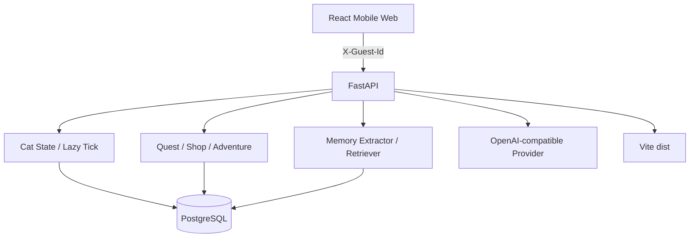
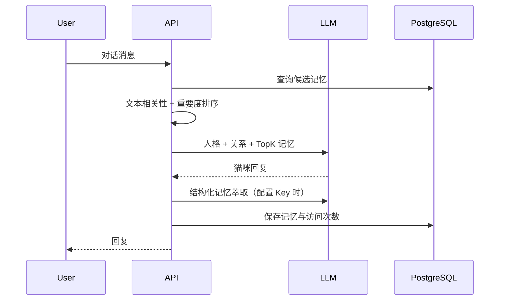

# MeowLog 系统架构

## 总览

## 模块职责

### 前端

- 房间场景与猫咪动画
- 领养、任务、商店、衣橱、手帐和聊天页面
- 游客 ID 生成与请求隔离
- Web Audio 与 Vibration API 反馈

### 后端

- 猫咪状态及离线结算
- 任务进度、签到与奖励原子结算
- 商店购买和资产校验
- 探险生命周期和 AI 手帐
- AI 对话、记忆萃取、相关性召回与删除

### 数据

| 表 | 用途 |
| --- | --- |
| `cats` | 状态、关系、货币、资产、穿搭、每日进度 |
| `memories` | 类型、内容、情绪、重要度、访问次数 |
| `chat_logs` | 用户与猫咪对话记录 |
| `adventures` | 探险状态、目的地、奖励和手帐 |

## Lazy Tick

应用不持续运行猫咪行为。每次玩家请求状态时：

1. 读取 `last_interact_time`
2. 计算离线小时数
3. 推演饱食度与心情衰减
4. 根据阈值选择饥饿、睡眠或空闲状态
5. 一次写回 PostgreSQL

这种方案适合低成本个人项目，减少定时任务和队列系统依赖。

## 长期记忆

无 AI Key 时使用规则提取和确定性演示回复，保证完整流程仍可体验。

## 安全边界

- API Key 只来自环境变量
- `.env` 和内部部署配置不进入 Git
- 游客 UUID 用于数据隔离，但不是强身份认证
- 商店购买采用事务与行锁，避免重复扣款
- 用户可以查看和删除长期记忆

## 部署

Docker 镜像采用多阶段构建：

1. Node 阶段构建 `frontend/dist`
2. Python 阶段安装后端依赖
3. 启动时幂等初始化数据库
4. FastAPI 同源托管前端与 API
